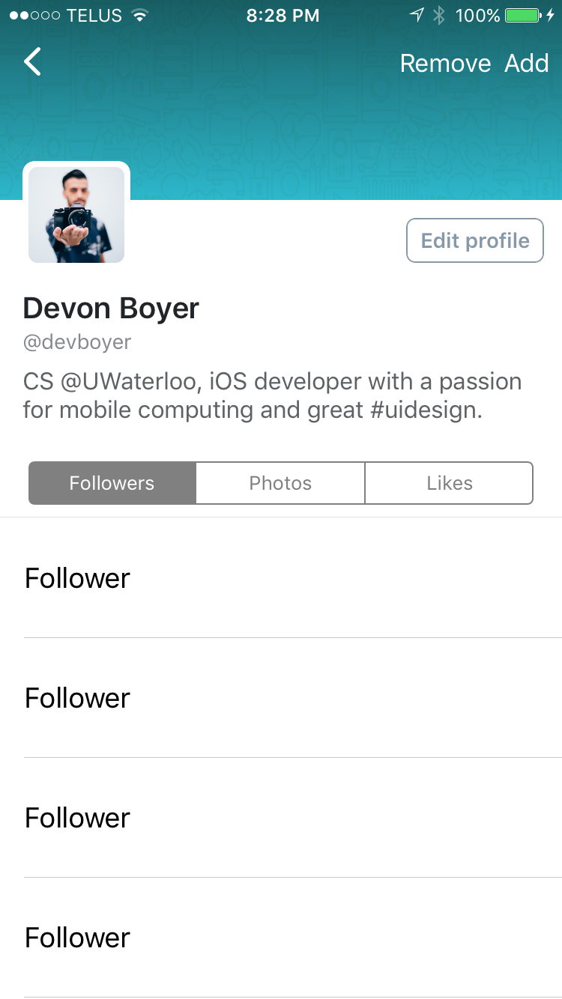
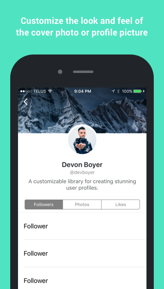

# DBProfileViewController

[](https://travis-ci.org/Devon Boyer/DBProfileViewController)
[](http://cocoapods.org/pods/DBProfileViewController)
[](http://cocoapods.org/pods/DBProfileViewController)
[](http://cocoapods.org/pods/DBProfileViewController)




## Overview

A customizable library for displaying a collection of content controllers and customizable accessory views associated with a profile interface. It was designed to address two use cases simultaneously:

1. Provide good looking, high quality implementations of familiar profile experiences out of the box. By default a `DBProfileViewController` is styled to look much like a Twitter profile.
2. Enable quick and easy customization of the user experience via layout attributes which change the appearance and behaviour of the accessory views.

## Installation

#### CocoaPods Installation

The recommended path for installation is [CocoaPods](http://cocoapods.org/). CocoaPods provides a simple, versioned dependency management system that automates the tedious and error prone aspects of manually configuring libraries and frameworks. You can add DBProfileViewController to your project via CocoaPods by doing the following:

```sh
$ sudo gem install cocoapods
$ pod setup
```

Now create a `Podfile` in the root of your project directory and add the following:

```ruby
pod 'DBProfileViewController'
```

Complete the installation by executing:

```sh
$ pod install
```

These instructions will setup your local CocoaPods environment and import DBProfileViewController into your project.

## Getting Started

1. Subclass - Subclass DBProfileViewController
2. Implement - The controller declares delegate and data source protocols. Your subclasses must implement these protocols.
3. Customize - The controller uses layout attributes to allow for effortless customization of accessory views.

## Content Controllers

View controllers that you wish too use as content controllers of a `DBProfileViewController` must conform to the `DBProfileContentPresenting` protocol.

## Accessory Views

There are 2 types of supported accessory views: `DBProfileAccessoryKindAvatar` and `DBProfileAccessoryKindHeader`. You must register the class you would like to use for a specfied accessory kind. For covenience, the library includes `DBProfileAvatarView` and `DBProfileCoverPhotoView` which provide sample implementations for an avatar view and header view, respectively.

```
[self registerClass:[DBProfileAvatarView class] forAccessoryViewOfKind:DBProfileAccessoryKindAvatar];
[self registerClass:[DBProfileCoverPhotoView class] forAccessoryViewOfKind:DBProfileAccessoryKindHeader];
```

### Layout Attributes

To customize the appearance and behaviour of accessory views you can change the associated layout attributes for the accessory view. The `DBProfileAccessoryViewLayoutAttributes` object manages the layout-related attributes for an accessory view in a profile view controller.

```
DBProfileHeaderViewLayoutAttributes *layoutAttributes = [self layoutAttributesForAccessoryViewOfKind:DBProfileAccessoryKindHeader];
layoutAttributes.headerStyle = DBProfileHeaderStyleNavigation;
layoutAttributes.headerOptions = DBProfileHeaderOptionStretch;
```

## Author

* [Devon Boyer](https://github.com/devonboyer)

## License

DBProfileViewController is available under the MIT license. See the LICENSE file for more info.
